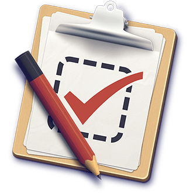

# JavaScript Framework Shootout

---

__Library__:

* A set of tools to reduce overhead and improve application consistency by providing reusable pieces of code.
* A library provides useful tools for a specific purpose (functions, helper libs) so you can build your app your way.

__Framework__:

* A **more opinionated** set of tools to reduce overhead and improve application consistency by providing reusable pieces of code.
* Inversion of control. Frameworks specify how you should write your app.

---

## MV\*? WTF?

* MVC, MVVM, MVP, MVW, MOVE all follow MV\*
* Quite a few different patterns being used in client side JS.
* Most are based off of MVC in some fashion.
* They are all really based on the [Observer Pattern](http://en.wikipedia.org/wiki/Observer_pattern).

---

## Client side MVC

Sit

---

## Client side MVVM

* Model: The data/domain model
* View: The view and view logic (buttons, templates, UI events)
* View Model: Converting model data to view data and back (data-binding)

---

## Client side MVP

* Model: The data/domain model
* View: The view (buttons, templates, routes UI events to presenter)
* Presenter: The middle-man between the view and the model (logic goes here!)

---

## [TodoMVC](http://todomvc.com/)

The same Todo application implemented using MV\* concepts in most of the popular JavaScript MV\*
frameworks of today.

* Backbone
* Ember
* AngularJS
* Spine
* KnockoutJS
* DOJO
* ...

---

## Backbone

* Created by [Jeremy Ashkenas](http://ashkenas.com/) and maintained by [Document Cloud](http://documentcloud.github.com/).
*

---

## [JavaScriptMVC](http://javascriptmvc.com)

One of the first client side JavaScript MVC frameworks first released about 5 years ago.

Provides full application stack with dependency manager, MVC framework (formerly jQueryMX),
functional testing library and documentation engine:

* CanJS
* jQuery++
* [StealJS](http://javascriptmvc.com/docs.html#!stealjs) - JavaScript file dependency manager
* [Funcunit](http://funcunit.com) - A QUnit and jQuery based functional testing library
* [DocumentJS](http://javascriptmvc.com/docs.html#!DocumentJS) - A JavaScript documentation engine

---

## CanJS

Client side MVC framework for building rich web applications. Supports *jQuery*, *Zepto*, *Mootools*,
*Dojo*, *YUI*.

* __can.Construct__ - inheritable constructor functions
* __can.Observe__ - observable objects
* __can.Model__ - observes connected to a RESTful JSON interface
* __can.view__ - template loading, caching, rendering
* __can.EJS__ - live binding templates
* __can.Control__ - declarative event bindings
* __can.route__ - back button and bookmarking support

---

## CanJS - Example

__A view__

    !html
    

__Controls and Models__

    !javascript
    var Todo = can.Model({
      findAll : 'GET /todos',
      findOne : 'GET /todos/{id}',
      create  : 'POST /todos',
      update  : 'PUT /todos/{id}',
      destroy : 'DELETE /todos/{id}'
    }, {});

    var Control = can.Control({
      'button click' : function() {
        document.findElementById('mydiv').innerHtml =
              can.view('todos', Todo.findAll());
      }
    });

---

## Resources

## Some Great Resources

* [Comparison from Throne of JS](http://blog.stevensanderson.com/2012/08/01/rich-javascript-applications-the-seven-frameworks-throne-of-js-2012/)
* [TODO MVC](http://todomvc.com/)
* [Journey Through The JavaScript MVC Jungle](http://coding.smashingmagazine.com/2012/07/27/journey-through-the-javascript-mvc-jungle/)
* [The Top 10 Javascript MVC Frameworks Reviewed](http://codebrief.com/2012/01/the-top-10-javascript-mvc-frameworks-reviewed/)

---
